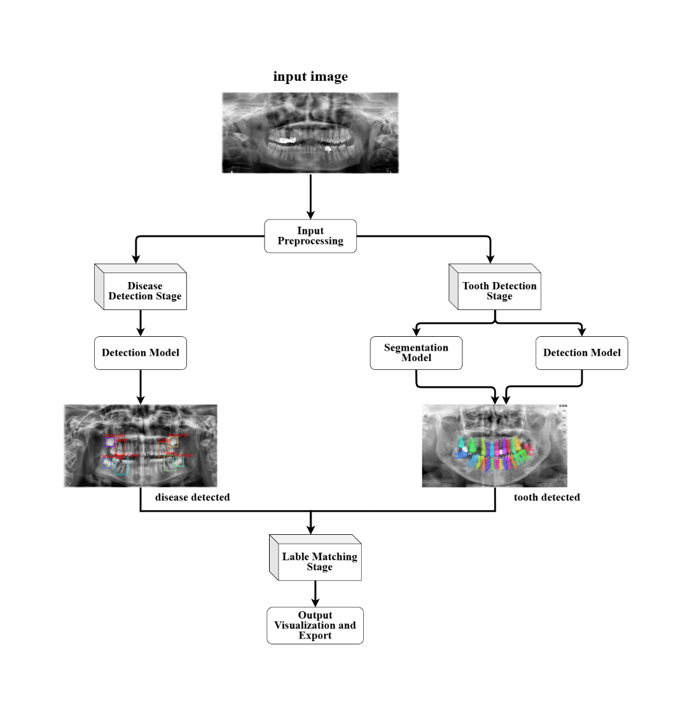
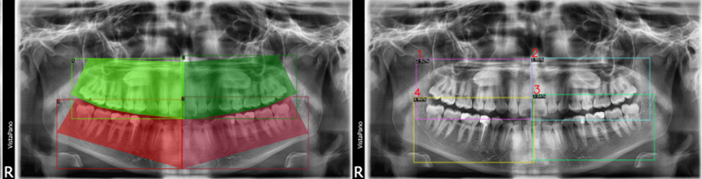
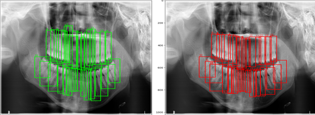
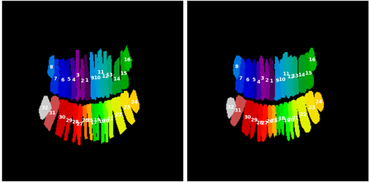
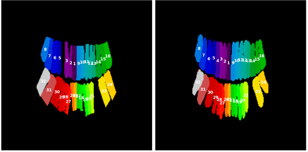
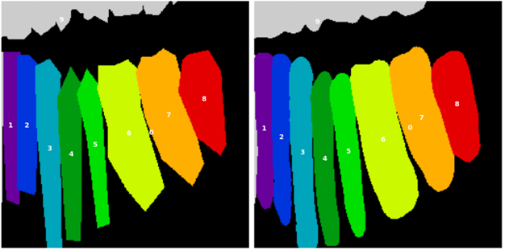
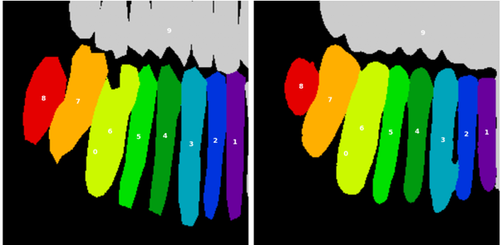
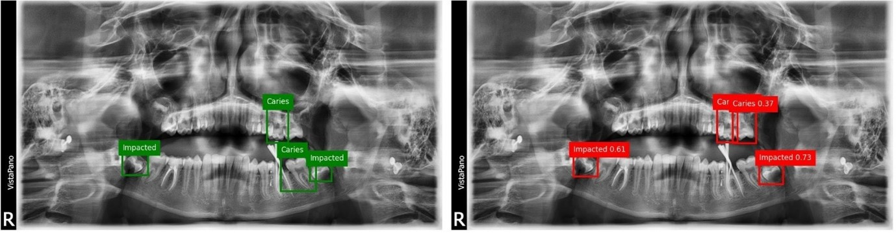
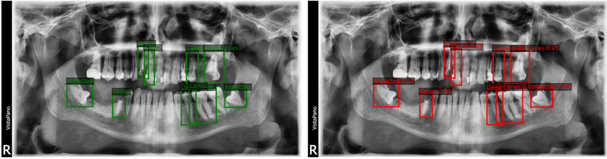

# Dentelligence System 🦷

**Automated AI-based Detection of Abnormal Teeth in Panoramic Dental X-rays**

## 📖 Overview

Dentelligence System is an AI-powered diagnostic pipeline designed to analyze panoramic dental X-rays. It detects and segments teeth, assigns FDI-based enumeration IDs, and identifies abnormalities such as caries, deep caries, periapical lesions, and impacted teeth.

Instead of relying on a single end-to-end model, the system uses **modular deep learning models** (Detection, Segmentation, Disease Classification), later integrated with **fusion and label matching**. This modularity increases adaptability to partially labeled datasets and diverse clinical settings.

The outputs include **annotated images, JSON/CSV metadata, and structured reports** for easy interpretation and integration into clinical workflows or education platforms.

---

## 🗂️ Repository Structure

```
Dentelligence-System/
│── 0_process_dataset.ipynb
│── 1_train_dino_res50_enumeration32_detection_Tooth_Detection.ipynb
│── 2_train_Unet&SEunet_enumeration32_detection_Tooth_Detection.ipynb
│── 3_train_Unet&SEunet_enumeration9_detection_Tooth_Detection.ipynb
│── 4_train_DiffusionDet_Quadrant_detection_Tooth_Detection.ipynb
│── 5_train_dino_swin_Disease_Detection.ipynb
│── 6_train_YOLO_Disease_Detection.ipynb
│── 7_process_Test_dataset.ipynb
│── 8_predict_evaluate.ipynb
│
├── Dentelligence System.docx
├── Dentelligence System.pdf
├── Dentelligence System.pptx
│
├── project_System Design.png
├── important links.txt
│
├── checkpoints/
├── configs/
├── models/
├── results/
├── runs/
├── runs_Disease_all/
│
├── dentex_dataset/
├── dentex_val/
├── dentex_test/
│
├── output_diffdet_quadrant/
├── output_dino_res50_enum32/
├── output_dino_swin_enum32/
├── output_seunet_enum32_07-25_16-46/
├── output_unet_enum32_07-25_13-34/
├── output_seunet_enum9_07-26_17-00/
├── output_unet_enum9_07-26_10-25/
├── output_dino_swin_disease/
├── output_swin_disease_all/
│
├── train_diffdet.py
├── train_dino.py
├── train_unet.py
├── train_yolo.py
└── util/
```

---

## 🧠 System Design



1. **Input Preprocessing**

   * Standardization, normalization, augmentation, and annotation restructuring.
2. **Tooth Detection**

   * **DiffusionDet** → Quadrant detection
   * **DINO (ResNet50)** → Tooth enumeration (32 teeth)
3. **Segmentation**

   * **U-Net & SE-U-Net** for Enumeration-32 and Enumeration-9 (quadrant-based) segmentation.
4. **Disease Detection**

   * **DINO (Swin Transformer)** and **YOLOv8x** for pathology detection.
   * **Weighted Boxes Fusion (WBF)** for robust ensemble outputs.
5. **Label Matching & Export**

   * Consolidates bounding boxes, masks, and disease labels.
   * Exports in PNG, JSON, and CSV formats.

---

## 📊 Results Summary

### 🔹 Quadrant Detection (DiffusionDet)

* Shows correct localization of upper and lower jaws (quadrants).
* **AP\@0.50 = 0.999, AP@\[.50:.95] = 0.705**



* Quadrant masks (green/red regions)
* 4-box quadrant splitting

---

### 🔹 Tooth Enumeration (DINO – ResNet50)

* Detects and numbers 32 teeth.
* **AP@\[.50:.95] = 0.569, Recall = 0.686**



* Bounding box detections on panoramic X-ray (green/red).
* Ground truth vs predictions comparison.
---

### 🔹 Tooth Segmentation – Enumeration-32

Both **U-Net** and **SE-U-Net** trained on full-mouth X-rays.
* **U-Net (epoch\_166): Dice = 0.7173**



* **SE-U-Net (last\_epoch): Dice = 0.7171**



* Colored segmentation masks with numbers 1–32.


---

### 🔹 Tooth Segmentation – Enumeration-9
Cropped quadrants (8 teeth + “out-of-quadrant” class).
* **U-Net (last\_epoch): Dice = 0.7882**



* **SE-U-Net (last\_epoch): Dice = 0.7949**



* Cropped quadrant segmentation masks with labels 1–9.
---
### 🔹 Disease Detection

Models trained to detect **Caries, Deep Caries, Periapical Lesions, Impacted Teeth**.

* **DINO-Swin (mAP@\[.50:.95] = 0.534)**
  


* **YOLOv8x (mAP@\[.50:.95] = 0.931, Precision = 0.993, Recall = 0.992)**



* Disease predictions (green vs red boxes).
* Ground truth vs model predictions.
* **WBF Ensemble (mAP@\[.50:.95] = 0.823)**
---

## 🚀 Future Work

* **Pipeline Integration** → Connect all models into one real-time workflow.
* **Explainable AI (XAI)** → Add saliency maps & activation visualizations.
* **Dataset Expansion** → More diseases, more diverse cases, semi-supervised learning.
* **Deployment** → GUI development, integration into EHR/HIS, cloud/mobile tele-dentistry.

---

## 📚 References & Resources

* [DINO (IDEA Research)](https://github.com/IDEA-Research/DINO/tree/main?tab=readme-ov-file)
* [DiffusionDet (Shoufa Chen)](https://github.com/ShoufaChen/DiffusionDet?tab=readme-ov-file)
* [U-Net (Ronneberger et al.)](https://github.com/milesial/Pytorch-UNet/tree/master)
* [SENet](https://github.com/hujie-frank/SENet/tree/master?tab=readme-ov-file)
* [Swin Transformer](https://github.com/microsoft/Swin-Transformer)
* [Weighted Boxes Fusion](https://github.com/ZFTurbo/Weighted-Boxes-Fusion)
* [DENTEX Dataset](https://huggingface.co/datasets/ibrahimhamamci/DENTEX/tree/main/DENTEX)

---

## 👩‍🎓 Authors

* **Mohammad Ismail**
* **Jullnar Radwan**
* **Rama AlHiyari**
* Supervised by: **Dr. Wafa Zaal Mohammad Almaaitah**
* **Faculty of Artificial Intelligence – Autonomous Systems Department**
* **Al-Balqa Applied University, August 2025**
